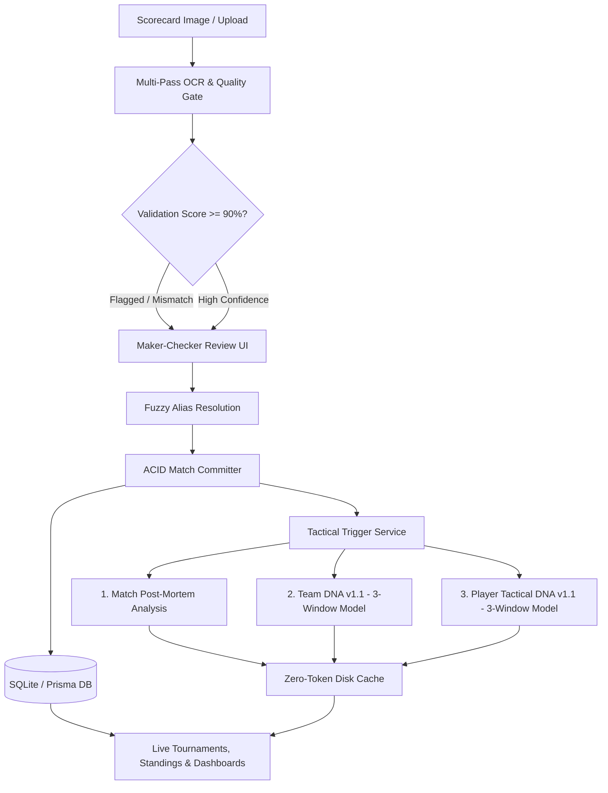

# 🏏 DesiSports V2

> **Next-Generation Indoor Cricket Intelligence, Scorecard Reconciliation & Tactical DNA Platform**

[](https://nextjs.org/)
[](https://www.typescriptlang.org/)
[](https://www.prisma.io/)
[](https://tailwindcss.com/)
[](scripts/test-rules.ts)
[](src/middleware.ts)
[]()

**Production URL:** [https://desisports.onrender.com/](https://desisports.onrender.com/)  
**Reference Companion:** [https://desisports.milanchheda.com/](https://desisports.milanchheda.com/)  
**Prompt Architect:** Manish Pandey (`manishp15@iimb.ac.in`)

---

## 📖 Overview

**DesiSports V2** is a specialized sports intelligence and analytics web application custom-built for **8-a-side Spawtz Indoor Cricket**.

Indoor cricket differs fundamentally from conventional outdoor cricket: matches feature 4 distinct batting partnerships (4 overs each = 16 overs), negative run penalties (`-5` runs per dismissal), Skin bonuses (1 point per skin), and Spawtz league tables (4 match points + up to 4 skin points = 8 max points).

DesiSports V2 solves the complex challenges of physical scorecard intake, optical character recognition errors, player name resolution, tactical intelligence extraction, and live tournament standings through a hardened, deterministic engineering pipeline.

---

## 🏛️ Core Architectural Pillars



### 1. Multi-Pass OCR Intake & Quality Gate
- **Deterministic Extraction**: Extracts 4 skins, 16 overs, batting pair tallies, bowling spells, and ball-by-ball tokens (`W`, `NB`, `(R)`, `-5`).
- **Mathematical Checksums**: Validates that skin run sums equal final team score, bowling overs equal 16.0, and dismissals match bowling figures.
- **Fixture Mismatch Guard**: Verifies uploaded team names against scheduled fixtures with fuzzy matching to prevent accidental cross-match overwrites.

### 2. Side-by-Side Maker-Checker Review
- **Split-Screen Verification**: Side-by-side view with zoomable scorecard image preview and interactive ball-by-ball correction table.
- **CSP & Media Resilience**: Content Security Policy configured with `blob:` and `data:` directives, with automated FileReader fallbacks to guarantee preview rendering across all browsers.
- **Duplicate Override Flow**: Smart detection of existing matches with seamless override and direct-linking into review without 422 ping-pong errors.

### 3. Name Resolver & Player Alias Dictionary
- **4-Stage Resolution**:
  1. Exact canonical name lookup.
  2. Database-backed alias dictionary (`PlayerAlias`).
  3. Levenshtein distance fuzzy matching ($\ge 0.85$ threshold).
  4. Unresolved fallback: flags player in Amber with one-click alias approval (`/admin/aliases`), guaranteeing match ingestion is never blocked.
- **Extra Player Handling**: Handles 9th substitute players and non-batting fielders without breaking the 4-skin (8-batter) partnership model.

### 4. The Three AI Tactical Engines (v1.1 Three-Window Model)
All three prompts are strictly isolated in `src/lib/` and implement the **Three-Window Evidence Model** to eliminate recency bias:

| Engine | File | Version | Evidence Model & Focus |
| :--- | :--- | :--- | :--- |
| **Match Analysis** | [`src/lib/tactical-prompt.ts`](src/lib/tactical-prompt.ts) | v1.0 | 4 skins, -5 penalties, chronological timeline anti-presentism, Bazooka over leverage |
| **Team DNA** | [`src/lib/team-dna-prompt.ts`](src/lib/team-dna-prompt.ts) | v1.1 | History (~30%), Tournament Baseline (~50%), Recent Form Window (~20%) |
| **Player Tactical DNA** | [`src/lib/player-dna-prompt.ts`](src/lib/player-dna-prompt.ts) | v1.1 | Career Baseline (~50%), Tournament (~30%), Recent Form (~20%) + 0–100 Performance Synergy |

- **Core Principle**: *History establishes the baseline, the full tournament establishes current profile, and recent matches identify short-term movement around that profile. A recent match is new evidence, not a new identity.*
- **Zero-Token Budget ($0 Cost)**: The `tactical-trigger-service.ts` caches AI outputs on disk and selectively updates only the 16 participating players upon match approval.
- **Observability Console (`/prompts`)**: Unlisted dashboard featuring read-only code embeds with line number gutters, token counters, LLM parameters, copy-to-clipboard, and plain-text download.

---

## 🔒 Security & Anti-Abuse Hardening (OWASP Compliant)

Designed to operate securely in public environments without per-user logins ($0 pocket budget):

- **SEC-01**: Admin Key fail-closed architecture via `crypto.timingSafeEqual` (zero hardcoded defaults).
- **SEC-02**: Sliding-window IP rate limiter on all API routes (`src/lib/rate-limiter.ts`).
- **SEC-03**: Deep prompt injection detector blocking injection payloads in scorecard text.
- **SEC-04**: Input sanitization stripping script/HTML tags from player names and scores.
- **SEC-05**: Strict Content Security Policy (CSP) with `default-src 'self'`, `frame-ancestors 'none'`, and restricted image sources.
- **SEC-06**: SSRF domain allowlist and path traversal sanitization on all file uploads.
- **SEC-07**: Edge middleware scraper filter blocking aggressive AI crawlers (GPTBot, ClaudeBot, etc.) and unlisted page protections (`X-Robots-Tag: noindex, nofollow`).
- **SEC-08**: Client-side bundle purity: zero environment variables or admin secrets leaked into React browser bundles.

---

## 📁 Repository Structure

```
desisports-v2/
├── prisma/
│   ├── schema.prisma              # Complete database schema (Player, Match, Skin, etc.)
│   ├── seed.js                    # Seed data for historical tournaments & matches
│   └── team_dna_cache.json        # Precomputed zero-cost Team DNA cache
├── public/
│   ├── uploads/scorecards/        # High-res scorecard images (WebP/JPG)
│   └── robots.txt                 # Public bot restrictions
├── scripts/
│   ├── test-rules.ts              # 40-Rule automated regression test suite
│   └── rerun-match-analyses.ts    # Admin script to re-trigger AI post-mortems
├── src/
│   ├── app/
│   │   ├── admin/                 # Elevated admin screens (scorecard intake, aliases)
│   │   ├── api/                   # Hardened REST endpoints (upload, approve, purge)
│   │   ├── captain/               # Captain's Intelligence & Matchup analysis
│   │   ├── matches/               # Match scorecards, skins, & post-mortems
│   │   ├── player/ & players/     # Career Player DNA & Performance Synergy profiles
│   │   ├── prompts/               # Unlisted observability console for the 3 prompts
│   │   ├── teams/                 # Team DNA profiles & pair combination matrices
│   │   └── tournaments/           # Tournament 0, 1 & 2 points tables & fixtures
│   ├── components/                # Reusable UI components & analytics providers
│   ├── lib/
│   │   ├── cache-revalidator.ts   # Dynamic route on-demand cache revalidation
│   │   ├── match-committer.ts     # Atomic 16-player ACID database persistence
│   │   ├── player-aliases.ts      # Fuzzy Levenshtein name resolution engine
│   │   ├── player-dna-prompt.ts   # Isolated System Prompt 3 (Player Tactical DNA v1.1)
│   │   ├── player-tactical.ts     # Career Tactical DNA & 0-100 Synergy calculator
│   │   ├── quality-gate.ts        # Mathematical checksums & OCR validation
│   │   ├── rate-limiter.ts        # Sliding-window IP rate limiter
│   │   ├── scorecard-extractor.ts # Multi-pass Spawtz scorecard parser
│   │   ├── security.ts            # Timing-safe auth, SSRF, & path traversal guards
│   │   ├── tactical-prompt.ts     # Isolated System Prompt 1 (Match Post-Mortem)
│   │   ├── tactical-trigger-service.ts # Event trigger service with zero-token cache
│   │   └── team-dna-prompt.ts     # Isolated System Prompt 2 (Team DNA v1.1)
│   └── middleware.ts              # Edge scraper defense, rate limiting & security headers
├── next.config.mjs                # Next.js standalone config & OWASP security headers
├── package.json                   # Dependencies and scripts
└── tsconfig.json                  # Strict TypeScript configuration
```

---

## 🚀 Getting Started

### Prerequisites
- **Node.js**: `v18.18.0` or higher (tested on Node 20 & 24)
- **npm**: `v9.0.0` or higher

### 1. Clone & Install
```bash
git clone https://github.com/mangoman2049/desisports-v2.git
cd desisports-v2
npm install
```

### 2. Configure Environment
Create a `.env` file in the root directory:
```env
DATABASE_URL="file:./dev.db"
ADMIN_SECRET_KEY="your-secure-admin-key-here"
NEXT_PUBLIC_GA_ID="G-SH3KLTD7S2"
```

### 3. Initialize Database
```bash
# Push Prisma schema to SQLite
npm run db:push

# Seed historical tournaments, teams, players, and match records
npm run db:seed
```

### 4. Run Development Server
```bash
npm run dev
```
Open [http://localhost:3000](http://localhost:3000) to view the application.

---

## 🧪 Testing & Verification

The repository includes a comprehensive 40-rule automated test suite:

```bash
# Run the complete test suite
npm test

# Alternatively run with tsx directly
npx tsx scripts/test-rules.ts
```

### Test Suite Highlights (40 Tests)
- **Tests 1–19**: Spawtz scoring math (4 skins, -5 penalties, net scores, 1 pt skin / 4 pt win).
- **Test 20**: Scorecard approval pipeline & 16-player persistence.
- **Tests 21–25**: Tournament 2 authentic squads (52 unique players, 0 duplicates) and 9 scheduled fixtures.
- **Test 26**: Real-time cache revalidation (`revalidateCricketCache`).
- **Test 27**: 3 Isolated Prompts Architecture & Career-Wide Player Tactical DNA.
- **Test 28**: Trigger points plumbing & Google Analytics integration (`G-SH3KLTD7S2`).
- **Test 29**: Unlisted `/prompts` console, subtabs, and code embed UI.
- **Tests 30–38**: OWASP security hardening (rate limiting, prompt injection, SSRF, path traversal, timing-safe auth, CSP).
- **Tests 39–40**: Match 8 Maker-Checker retrieval & CSP `blob:` preview rendering.

---

## 📦 Production Deployment

### Build
```bash
npm run build
```

### Render Deployment
This repository is configured for zero-downtime deployment on [Render](https://render.com) using the standalone Next.js server:
- **Build Command**: `npm run build`
- **Start Command**: `npm run start`

---

## 🤝 Contributing & Handover Notes

When integrating these modules into another codebase (e.g. `desisports.milanchheda.com`):
1. **Extra Player Handling**: Always permit $N \ge 8$ players in `PlayerMatchStat` to record bowling/fielding for substitutes, while keeping the 4 `Skin` models locked to 2 batters each.
2. **Alias Reconciliation**: Use `src/lib/player-aliases.ts` to capture OCR variations in `PlayerAlias` rather than mutating historical names.
3. **Prompt Integrity**: Keep system prompts isolated in `src/lib/*-prompt.ts` with explicit author and version metadata.

---

## 📄 License & Attribution

- **Application Architecture & Engineering**: DesiSports Staff+ Full-Stack Team
- **Tactical Intelligence Prompts**: Authored by **Manish Pandey** (`manishp15@iimb.ac.in`)
- **Proprietary Notice**: Developed for the DesiSports Indoor Cricket Community. All rights reserved.
